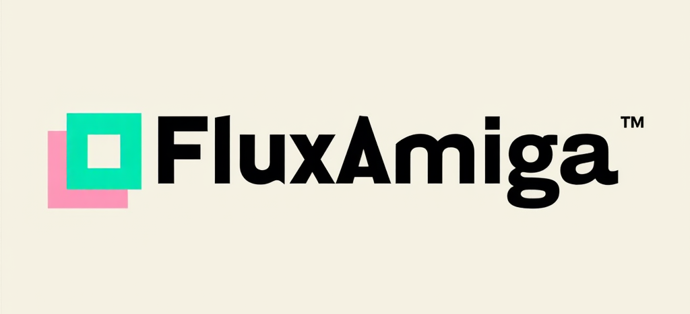

# FluxAmiga - Retro Demo Player

 

Welcome to **FluxAmiga**, a web-based demo player that brings the nostalgic magic of Commodore and Amiga demos to your browser. Inspired by the golden era of retro computing, FluxAmiga lets you relive the sights and sounds of the past with a modern twist—no floppy disks required!

## Features

- **Web-Based Playback**: Load and play audio demos directly in your browser.
- **Retro Aesthetic**: A sleek, Amiga-inspired UI with neon green vibes and a terminal feel.
- **Simple Controls**: Play, pause, and stop your demos with ease.
- **Extensible**: Built to grow—add MOD file support, visuals, or more!

## Demo

*(Coming soon!)*

## Getting Started

### Prerequisites
- A modern web browser (Chrome, Firefox, Edge, etc.).
- Audio files to test (MP3, WAV, or others supported by the HTML5 `<audio>` tag).

### Installation
1. Clone this repository:
   ```bash
   git clone https://github.com/frangedev/FluxAmiga.git
   ```
2. Navigate to the project folder:
   ```bash
   cd FluxAmiga
   ```
3. Open `index.html` in your browser:
   - On Windows: Double-click `index.html`.
   - On Mac/Linux: Use `open index.html` or drag it to your browser.

### Usage
1. Launch FluxAmiga by opening `index.html`.
2. Click the file input to upload an audio demo.
3. Use the **Play**, **Pause**, and **Stop** buttons to control playback.
4. Enjoy the retro vibes!

## Roadmap

- [ ] Add support for Amiga MOD files using `libopenmpt.js`.
- [ ] Integrate retro visuals (e.g., scrollers, bouncing sprites) with HTML5 Canvas.
- [ ] Enable demo fetching from GitHub or external URLs.
- [ ] Optimize for mobile browsers.

## Contributing

Want to bring more retro flair to FluxAmiga? Contributions are welcome! Here’s how:
1. Fork this repo.
2. Create a branch (`git checkout -b feature/awesome-idea`).
3. Commit your changes (`git commit -m "Added awesome idea"`).
4. Push to your branch (`git push origin feature/awesome-idea`).
5. Open a Pull Request.

Please follow the [Code of Conduct](CODE_OF_CONDUCT.md) (TBD) and keep it fun and retro!

## License

This project is licensed under the MIT License—see the [LICENSE](LICENSE) file for details.

## Acknowledgments

- Inspired by the Amiga demo scene and Commodore legacy.
- Built with love for retro computing enthusiasts everywhere.
